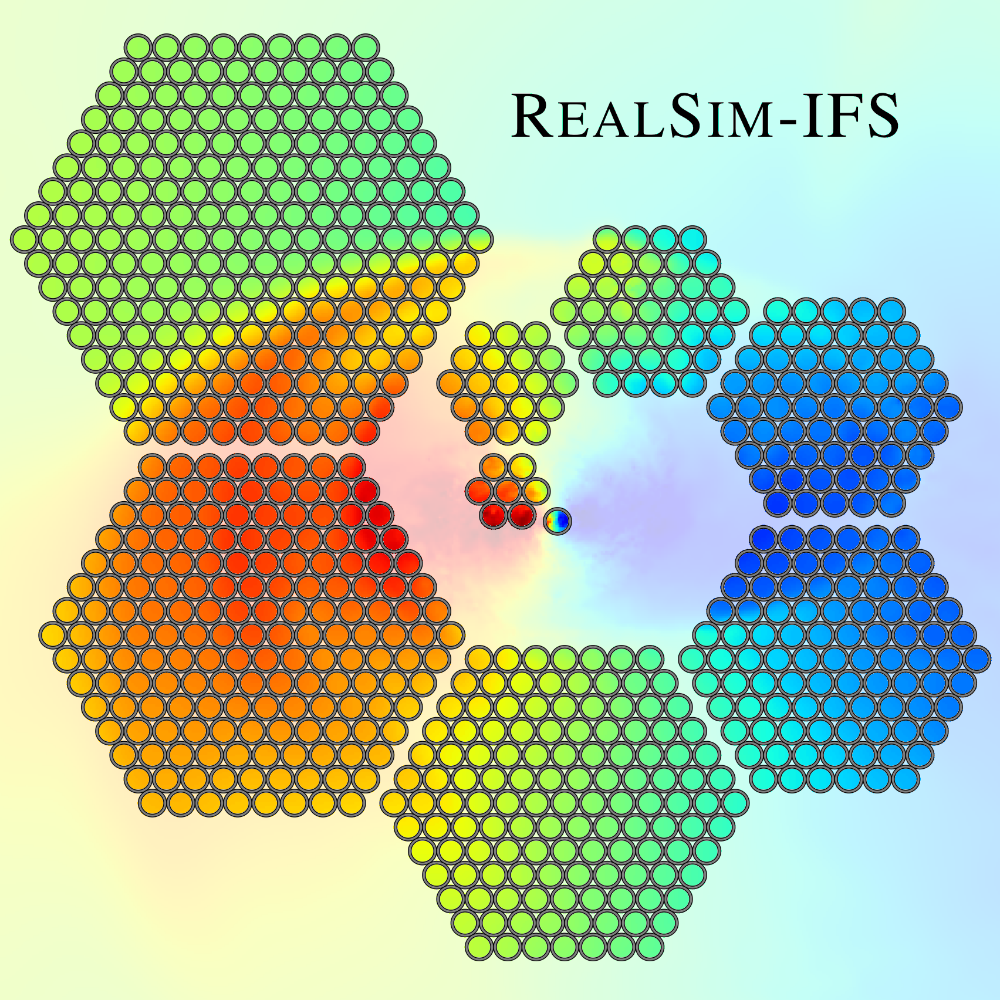

RealSim-IFS is a tool for generating survey-realistic integral-field spectroscopy (IFS) obvervations of galaxies from numerical  simulations of galaxy formation and evolution. The tool is designed primarily to emulate the observing strategies of major IFS galaxy surveys in astronomy. But it also offers the flexibility to design your own observing strategies. 

### November 27th, 2019
RealSim-IFS is currently under development. Functionality for the MaNGA(Bundy et al. 2015) and SAMI (Croom et al. 2013, Bryant et al. 2015) IFS surveys are taking priority and are nearing completion. Feel free to contact me for more info (functionality, expected full release, collaborative opportunities, etc.). A pre-release will be available as soon as the code is complete and all of the main functionalities have been tested. From then on, the code will be public throughout further development. 

### January 20th, 2020
The main functionality for the data-cube generation modules are now complete and have been tested for intensity conservation for all methods.
